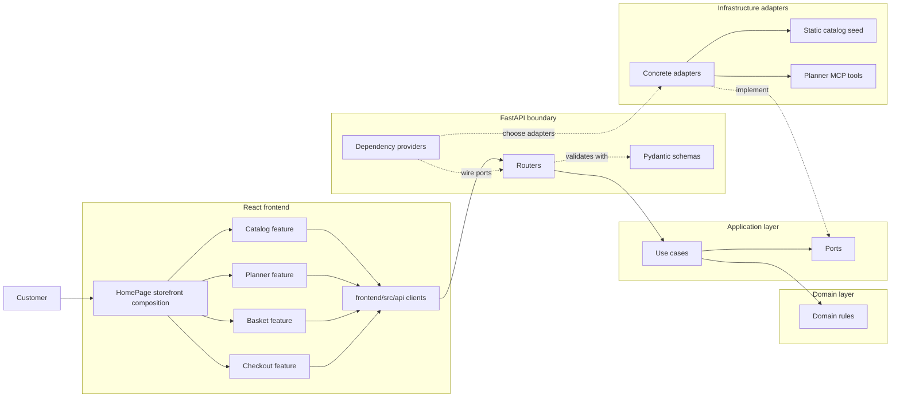

# Tavola Architecture Guide

Tavola is a focused e-commerce demonstrator for an independent Italian deli. It
shows a small, understandable commerce flow: customers browse a real static
catalog, build a backend-owned basket, complete mock pickup checkout, and can
use Tavola's Planner to turn an occasion or meal request into a validated basket
proposal. The goal is not to model a full commerce platform; it is to make the
current user flow clear, trustworthy, and easy to reason about.

This guide is based on the current source tree. `AGENTS.md` defines how to work
in the repository, and `CONTEXT.md` is the authority for product language, scope,
and Tavola-specific rules.

## Architecture At A Glance

The backend is a FastAPI application organized around domain-driven boundaries:

- `backend/src/tavola/api`: HTTP routing, dependency injection, and Pydantic
  request/response schemas.
- `backend/src/tavola/application`: use cases, which are focused workflow entry
  points such as browsing catalog, adding basket lines, creating checkout
  orders, and validating planner proposals. They coordinate domain objects and
  repository or agent ports; they do not own HTTP details or concrete storage.
- `backend/src/tavola/domain`: entities and value objects that own business
  rules and invariants with no framework or infrastructure dependencies.
- `backend/src/tavola/infrastructure`: concrete implementations behind the
  application ports, including static seed data, in-memory repositories, the
  Codex Planner adapter, the Planner MCP server, and background execution.
- `backend/src/tavola/config`: environment-backed settings and Planner runtime
  status.

The frontend is a React and TypeScript Vite app. `frontend/src/pages/HomePage.tsx`
owns the storefront composition: Shop and Plan workflow tabs, a persistent Basket
side panel, and a Checkout panel. Feature folders own user workflow state and
presentation, while `frontend/src/api` maps HTTP transport into typed
`ApiResult<T>` values and validates response shape before UI code consumes it.

Read the backend dependency direction as core-first. Routers receive concrete
objects from FastAPI dependency providers, but they type those objects as
application `Protocol` ports such as `BasketRepository`, `CatalogRepository`,
`PlannerSessionRepository`, and `MenuPlannerAgent`. The route then constructs a
use case and calls it. The use case owns the workflow, the domain objects own
the business rules, and infrastructure only supplies concrete implementations
for the ports.

## Key Backend Concepts

| Concept | Domain | Application | Infrastructure | Boundary rule |
| --- | --- | --- | --- | --- |
| Catalog | `CatalogSku`, `CatalogCategory`, `Money`, and `DietaryFacets` define sellable product identity | `BrowseCatalog`, `GetCatalogSkuDetail`, `ListAvailableCatalogTags`, and `FindCatalogCandidates` use the `CatalogRepository` port | `catalog_seed.py` and `StaticCatalogRepository` provide static inventory in display order | Catalog owns SKU identity, availability, pricing, categories, tags, and dietary facets |
| Basket | `Basket` enforces unique SKU lines, positive integer quantities, max quantity 10, and server totals | `CreateBasket`, `GetBasket`, `AddBasketLine`, `SetBasketLineQuantity`, and `RemoveBasketLine` coordinate basket mutations | `InMemoryBasketRepository` stores basket state | Backend-owned basket is the checkout source of truth; frontend state does not own pricing or quantity rules |
| Checkout | Pickup windows, contact details, order lines, and orders model mock pickup checkout | `ListPickupWindows` and `CreateCheckoutOrder` validate pickup/contact details, recheck SKU availability, create order lines, and empty the basket | `StaticPickupWindowRepository` and `InMemoryOrderRepository` provide pickup windows and mock orders | Checkout demonstrates order creation without payment, fulfillment, shipping, or accounts |
| Planner | Planner sessions, proposal statuses, package templates, courses, proposal lines, validation errors, and validated proposals define AI-assisted planning | Planner use cases create sessions, continue planning, validate/revalidate proposals, and accept proposals into baskets through ports | Codex/fake planner agents, background runner, in-memory sessions, and `planner_mcp_server.py` provide the runtime | Codex can suggest; catalog and basket validation must approve real SKUs before basket mutation |

## API Routes

`Settings.api_prefix` defaults to `/api`, so these route paths are served under
that prefix in local frontend requests.

- `GET /health`: returns API service status.
- `GET /catalog`: lists catalog categories and available product summaries,
  optionally filtered by `category` and `q`.
- `GET /catalog/products/{sku_id}`: returns product detail for an available SKU.
- `POST /baskets`: creates an empty basket.
- `GET /baskets/{basket_id}`: loads a basket.
- `POST /baskets/{basket_id}/lines`: adds a SKU quantity to a basket.
- `PATCH /baskets/{basket_id}/lines/{sku_id}`: replaces a line quantity.
- `DELETE /baskets/{basket_id}/lines/{sku_id}`: removes a line.
- `GET /checkout/pickup-windows`: lists backend-defined pickup windows.
- `POST /checkout`: creates a mock order from a basket and clears that basket.
- `GET /planner/status`: reports whether live Planner assistance is available.
- `POST /planner/sessions`: creates a planning session and starts background
  completion.
- `GET /planner/sessions/{planner_session_id}`: fetches the current session
  state.
- `POST /planner/sessions/{planner_session_id}/follow-up-answer`: submits a
  follow-up answer and restarts planning.
- `POST /planner/sessions/{planner_session_id}/proposal/validate`: revalidates
  an edited proposal.
- `POST /planner/sessions/{planner_session_id}/accept`: appends or replaces
  basket lines from a validated proposal and returns meal-plan grouping metadata.

## Frontend Boundaries

`frontend/src/App.tsx` renders `HomePage`. `HomePage` coordinates the current
storefront workflow, preserves the persistent basket, opens checkout, and passes
accepted Planner baskets back into basket state.

The current feature areas are:

- `frontend/src/features/catalog`: catalog browsing, filters, product grid,
  product detail, image mapping, and catalog formatting.
- `frontend/src/features/basket`: basket loading, local basket id persistence,
  mutation state, line items, totals, and the persistent Basket panel.
- `frontend/src/features/checkout`: pickup-window loading, checkout form state,
  submission, order success state, and the Checkout panel.
- `frontend/src/features/planner`: Planner availability, prompt/follow-up flow,
  session polling, proposal editing, revalidation, acceptance, and proposal
  review UI.

`frontend/src/api/client.ts` is the transport boundary. It builds URLs from
`VITE_API_BASE_URL` or `/api`, normalizes network/HTTP/invalid-response errors,
and extracts FastAPI validation messages. Each workflow API module validates the
response shape before returning data to feature hooks.

## Data Flow

| Flow | Starts | Frontend | Backend | Rule/source of truth |
| --- | --- | --- | --- | --- |
| Catalog browsing | `CatalogBrowser` and `useCatalogBrowser` | `getCatalog` and `getCatalogProduct` call `/api/catalog` | Catalog routes delegate to `BrowseCatalog` and `GetCatalogSkuDetail` | `StaticCatalogRepository` exposes seed catalog SKUs; search matches names, categories, descriptions, tags, and positive dietary facets |
| Basket editing | `useBasket` | Creates or reloads a basket, stores the basket id locally, and sends add/update/remove mutations through `frontend/src/api/basket.ts` | Basket routes invoke create, load, add, set quantity, and remove use cases | Use cases check catalog existence and availability; `Basket` owns quantity and total invariants |
| Checkout | `HomePage` opens `CheckoutPanel` | `useCheckout` loads pickup windows, blocks empty baskets, and submits contact details plus basket id | `CreateCheckoutOrder` validates pickup/contact details, rechecks SKU availability, creates order lines, persists an order, and empties the basket | Checkout is mock pickup checkout; order lines and basket state remain backend-owned |
| Planner | `PlannerWorkspace` and `usePlanner` | Checks runtime status, creates sessions, polls, handles follow-up answers, edits/revalidates proposal lines, and accepts proposals | Planner routes coordinate session use cases, background completion, proposal validation, and acceptance | Raw Codex output is validated through catalog and basket rules before any basket mutation |

## Tests And Scripts

Backend tests live in `backend/tests` and cover domain rules, application use
cases, API routes, infrastructure repositories, Planner MCP tools, Codex Planner
adapter behavior, settings, package layout, and seed catalog data. Frontend tests
live beside source files under `frontend/src` and cover API clients, feature
hooks, workflow components, formatting helpers, image mapping, and app
composition.

Common backend commands:

- `cd backend && uv sync`
- `cd backend && uv run pytest`
- `cd backend && uv run ruff check .`
- `cd backend && uv run ruff format --check .`

Common frontend commands:

- `cd frontend && npm install`
- `cd frontend && npm run dev`
- `cd frontend && npm test`
- `cd frontend && npm run lint`
- `cd frontend && npm run build`

For frontend changes or browser-facing workflows, also run the approval checklist
in `docs/frontend-browser-approval-check.md`. After scaffold or cross-service
workflow changes, use `docs/scaffold-smoke-check.md`.

## Mermaid Diagram

## Where To Start

For an API contract change, start at the router and schema for the workflow,
then update the matching frontend API client and tests. Keep transport validation
at the boundary rather than spreading response-shape assumptions through UI
components.

For a domain rule change, start with a domain test and the relevant domain module.
Then update application use cases, API error mapping, frontend behavior, and
tests only where the rule crosses those boundaries.

For a UI workflow change, start in the feature folder that owns the workflow
state. `HomePage` should stay focused on composition and cross-feature wiring,
while hooks and feature components own local loading, empty, error, success, and
pending states.

For a Planner change, identify whether the behavior belongs in Planner domain
rules, application validation/acceptance, the Codex adapter prompt and parsing,
or the MCP tools. The basket remains the checkout source of truth, so Planner
acceptance must still produce valid basket lines backed by real SKUs.
